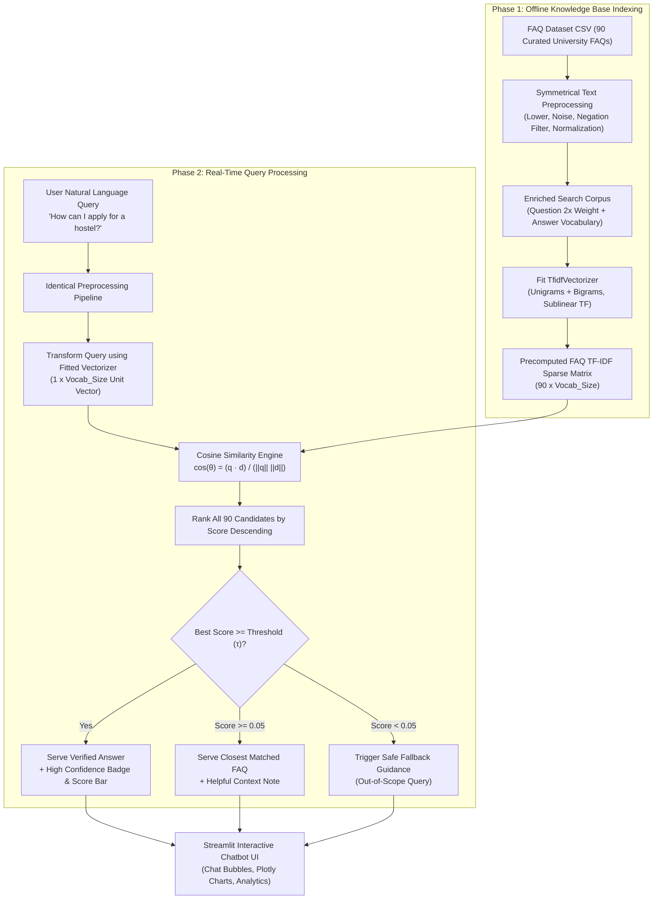

# FAQSense — Retrieval-Based FAQ Chatbot
## Complete Project Architecture, Technical Workflow & PPT Presentation Guide
> **Course:** Natural Language Processing (NLP) — Mid-2 Assignment Project  
> **Core Techniques:** Text Preprocessing, TF-IDF Vector Space Model, Cosine Similarity, Dynamic Thresholding  
> **Architecture:** 100% Deterministic Information Retrieval (IR) • Zero Generative Hallucination • Sub-Millisecond Inference

---

## 📑 Table of Contents
1. [Project Executive Summary](#1-project-executive-summary)
2. [Problem Statement & Motivation](#2-problem-statement--motivation)
3. [Traditional IR vs. Generative LLMs](#3-traditional-ir-vs-generative-llms)
4. [End-to-End System Architecture](#4-end-to-end-system-architecture)
5. [NLP Preprocessing Pipeline](#5-nlp-preprocessing-pipeline)
6. [Mathematical Foundations & Algorithms](#6-mathematical-foundations--algorithms)
7. [Dataset & Knowledge Base Details](#7-dataset--knowledge-base-details)
8. [Software Modules & Codebase Structure](#8-software-modules--codebase-structure)
9. [User Interface & Key Features](#9-user-interface--key-features)
10. [Automated Unit Testing & Verification](#10-automated-unit-testing--verification)
11. [Slide-by-Slide PPT Presentation Deck (12 Slides)](#11-slide-by-slide-ppt-presentation-deck-12-slides)
12. [Top 15 Viva Questions & Model Answers](#12-top-15-viva-questions--model-answers)

---

## 1. Project Executive Summary

* **Project Name:** FAQSense (Retrieval-Based FAQ Chatbot)
* **Objective:** Develop an automated, reliable FAQ conversational assistant that answers natural language questions using a pre-indexed knowledge base of 90 curated university questions and answers across 13 domains.
* **Core Philosophy:** In high-stakes institutional environments (such as university admissions, fees, hostel regulations, and examination notices), **accuracy and auditability are non-negotiable**. Unlike generative Large Language Models (LLMs) which synthesize text and are prone to hallucinations, this chatbot uses **Vector Space Modeling (TF-IDF)** and **Cosine Similarity** to retrieve strictly human-verified, deterministic answers.
* **Tech Stack:**
  * **Language:** Python 3.12
  * **NLP & Information Retrieval:** Scikit-Learn (`TfidfVectorizer`), NLTK (`PorterStemmer`, `stopwords`), NumPy
  * **Frontend UI:** Streamlit (Custom Responsive CSS with Google Fonts *Inter* & *Outfit*)
  * **Visualizations:** Plotly Express (`px.line`), Plotly Graph Objects (`go.Figure`, `go.Bar`, `go.Pie`)
  * **Testing:** Python `unittest` (12 test cases, 100% pass rate in <0.05s)

---

## 2. Problem Statement & Motivation

### The Challenge:
University portals contain extensive documentation (admissions brochures, hostel rules, fee notices, academic credit frameworks). Students and parents face significant friction:
1. Navigating through multiple PDF notices is slow and confusing.
2. Administrative staff answer the same repetitive queries hundreds of times per week.
3. Commercial LLM APIs (OpenAI, Anthropic) require costly API subscriptions, active internet connectivity, and can fabricate false dates or fee amounts (hallucination).

### The Proposed Solution:
A **lightweight, offline-capable Retrieval Chatbot** that:
* Accepts raw user queries in casual, natural language.
* Converts queries into high-dimensional mathematical vectors.
* Matches query vectors against a pre-indexed university FAQ corpus using Cosine Similarity.
* Evaluates match confidence against an adjustable similarity threshold ($\tau$).
* Instantly serves verified answers with confidence metrics and technical transparency.

---

## 3. Traditional IR vs. Generative LLMs

| Attribute | Generative LLMs (e.g., ChatGPT) | FAQSense (Retrieval-Based IR) |
| :--- | :--- | :--- |
| **Response Generation** | Synthesizes novel word sequences token-by-token | Retrieves verbatim, human-approved answers |
| **Hallucination Risk** | High (can invent non-existent rules/deadlines) | **Zero (100% deterministic)** |
| **Computational Footprint**| Massive GPU clusters / Cloud APIs | **Lightweight CPU execution (<50MB RAM)** |
| **Inference Latency** | 1,000ms – 5,000ms | **< 5 milliseconds (sub-millisecond retrieval)** |
| **Internet Dependency** | Requires continuous cloud API access | **100% Offline and local** |
| **Auditability** | Black-box neural weights | **Fully transparent mathematical vector dot products** |
| **Cost** | Per-token commercial billing | **Free & Open Source** |

---

## 4. End-to-End System Architecture



---

## 5. NLP Preprocessing Pipeline

To ensure maximum lexical alignment between student queries and the FAQ database, both inputs pass through an **identical, symmetrical preprocessing pipeline**:

```text
Raw Text Input
  │
  ▼
[1. Case Folding] ──────> text.lower()
  │
  ▼
[2. Domain Normalization] > Regex substitutions:
                            - "wi-fi" / "wi fi" ──> "wifi"
                            - "ph.d" / "ph d"   ──> "phd"
                            - "dr."             ──> "dr"
                            - "pin code"        ──> "pincode"
  │
  ▼
[3. Noise Stripping] ────> Remove URLs (http/https/www), strip punctuation marks, 
                            and normalize contiguous whitespace.
  │
  ▼
[4. Tokenization] ───────> Split on regex word boundaries: \b[a-z0-9]+\b
  │
  ▼
[5. Stopword Filtering] ─> Remove standard high-frequency English functional words 
                            (e.g., "is", "the", "at", "which") using NLTK stopwords.
                            Preserves negation tokens ("not", "no") to preserve query intent.
  │
  ▼
[6. Stemming/Lemmatizing]> Porter Stemmer / WordNet Lemmatizer reduces words to morphological root:
                            - "established" ──> "establish"
                            - "facilities"  ──> "facil"
                            - "counselling" ──> "counsel"
  │
  ▼
Normalized Search String
```

---

## 6. Mathematical Foundations & Algorithms

### 1. Term Frequency (TF) with Sublinear Scaling
Term frequency measures how often term $t$ appears in document $d$. Standard term frequency linearly biases toward long, repetitive documents. We apply **sublinear logarithmic scaling**:

$$\text{TF}(t, d) = \begin{cases} 1 + \log(f_{t, d}) & \text{if } f_{t, d} > 0 \\ 0 & \text{otherwise} \end{cases}$$

* **Rationale:** A document where a keyword appears 10 times is relevant, but not 10 times more informative than a document where it appears once. Log scaling dampens repetition distortion.

### 2. Inverse Document Frequency (IDF) with Smoothing
Measures how discriminative or informative a term is across the entire corpus $D$:

$$\text{IDF}(t, D) = \log\left(\frac{1 + |D|}{1 + \text{DF}(t)}\right) + 1$$

* $|D|$: Total number of documents in the FAQ corpus (90).
* $\text{DF}(t)$: Document frequency (count of FAQs containing term $t$).
* **Smoothing $+1$:** Prevents division-by-zero errors when encountering unseen terms.
* **Rationale:** Frequent words like "university" appear in many FAQs and receive lower IDF weight. Unique discriminative terms like "hostel", "Wi-Fi", "pincode", or "scholarship" receive high IDF weights.

### 3. TF-IDF Score & L2 Normalization
$$\text{TF-IDF}(t, d, D) = \text{TF}(t, d) \times \text{IDF}(t, D)$$

Each document vector is mapped into Euclidean unit length using **L2-normalization**:

$$\vec{v}_{\text{norm}} = \frac{\vec{v}}{\|\vec{v}\|_2} = \frac{\vec{v}}{\sqrt{\sum_{k} v_k^2}}$$

* **Rationale:** Ensures that the physical word count of an FAQ answer does not artificially inflate its similarity score over shorter, concise answers.

### 4. Cosine Similarity
Evaluates the geometric cosine of the angle $\theta$ between the user query vector $\vec{q}$ and each FAQ document vector $\vec{d}_i$:

$$\text{Cosine Similarity}(\vec{q}, \vec{d}_i) = \cos(\theta) = \frac{\vec{q} \cdot \vec{d}_i}{\|\vec{q}\|_2 \|\vec{d}_i\|_2} = \sum_{k=1}^{V} q_k \cdot d_{ik}$$

*(Since both vectors are already L2-normalized, cosine similarity reduces to a lightning-fast vector dot product).*

* **Range:** $[0.0, 1.0]$ for non-negative TF-IDF space.
  * $1.0$: Identical lexical orientation (perfect match).
  * $0.0$: Completely orthogonal (zero overlapping vocabulary).

### 5. Configurable Decision Boundary ($\tau$)
$$\text{Action} = \begin{cases} 
\text{Serve Exact FAQ Answer} & \text{if } \max(\text{sim}) \ge \tau \\
\text{Serve Closest Candidate Match} & \text{if } 0.05 \le \max(\text{sim}) < \tau \\
\text{Trigger Fallback Response} & \text{if } \max(\text{sim}) < 0.05 
\end{cases}$$

* **Default:** $\tau = 0.18$.
* **Sidebar Slider:** Dynamically tunable from $0.00$ to $1.00$ with step size $0.01$.

---

## 7. Dataset & Knowledge Base Details

The FAQ database contains **90 curated university questions and answers** across **13 functional categories**:

| Category | Count | Sample Question Covered |
| :--- | :---: | :--- |
| **Academics** | 15 | *"What academic system does the university follow?"* |
| **Admission** | 13 | *"Does the university use CUET for admission?"* |
| **University Overview** | 12 | *"When was Dr. Harisingh Gour Vishwavidyalaya established?"* |
| **Campus Facilities** | 11 | *"Does the university have Wi-Fi?"* |
| **Student Services** | 10 | *"Does the university have a placement cell?"* |
| **University History** | 6 | *"Who was Dr. Sir Harisingh Gour?"* |
| **Hostel** | 5 | *"How can I apply for a hostel?"* |
| **Contact** | 4 | *"What is the Registrar office email address?"* |
| **Museum** | 4 | *"Where is Gour Sangrahalaya located?"* |
| **Research** | 3 | *"Does the university support PhD research?"* |
| **Examination** | 3 | *"Where can I find examination notifications?"* |
| **Campus Life** | 3 | *"Does the university organize cultural activities?"* |
| **General Information** | 1 | *"Where can I find the latest university notices?"* |
| **Total** | **90** | **Comprehensive Institutional Coverage** |

### Enriched Multi-Field Indexing:
Rather than indexing only the question string, the search representation is composed as:
$$\text{Search Corpus} = \text{Question} \oplus \text{Question} \oplus \text{Answer}$$
* Weighting the question $2\times$ preserves question-first matching priority.
* Appending the answer vocabulary allows users who query specific factual entities found inside the answer (e.g. *"SBI ATM"*, *"PIN code 470003"*, *"Valley campus"*, *"central university status"*) to retrieve the correct answer seamlessly.

---

## 8. Software Modules & Codebase Structure

```text
NLP MID-2 ASSIGNMENT/
│
├── app.py                     # Streamlit web app & interactive dashboard
├── chatbot/                   # Core NLP retrieval engine package
│   ├── __init__.py            # Module exports
│   ├── config.py              # Hyperparameters, threshold constants, suggested queries
│   ├── preprocessing.py       # Symmetrical text cleaning, regex substitutions, stemming
│   └── retrieval.py           # TF-IDF vectorizer, cosine similarity engine, candidate ranking
│
├── data/
│   └── faqs.csv               # 90 Curated FAQs across 13 university categories
│
├── utils/
│   ├── __init__.py
│   └── helpers.py             # Custom CSS, session management, Plotly Express & GO charts
│
├── tests/
│   └── test_retrieval.py      # 12 Automated unit tests (Unittest suite)
│
├── requirements.txt           # Minimal, production dependencies
└── README.md                  # Academic documentation & viva reference
```

---

## 9. User Interface & Key Features

### 1. Modern Conversational Chat Interface (`💬 Chat Assistant`)
* **Header with Online Pulse Indicator:** Displays real-time status (`● NLP IR Pipeline Online (90 FAQs)`).
* **1-Click Quick-Prompt Chips:** 8 pre-configured query buttons (`🏛️ Establishment`, `🎓 Admissions`, `🏠 Hostels`, `📚 Library`, `🔬 Research`, `📶 Wi-Fi`, `📞 Registrar`, `🏛️ Museum`) for instantaneous viva demonstration.
* **Streamlined Chat Stream:** Clear distinction between User message bubbles and Assistant response cards.
* **Retrieval Insights Footer:**
  * Confidence Badge: `🎯 High Confidence • 89% (0.89)` / `💡 Closest FAQ Match`.
  * Category Pill: `📂 Admission`, `📂 Hostel`, etc.
  * Visual Confidence Bar: Progress indicator representing similarity score against threshold $\tau$.
  * Collapsible Technical Inspection Expander: Shows preprocessed NLP tokens, threshold value, candidate ranking bar chart, and candidate scoring table.

### 2. Knowledge Base Explorer (`📚 FAQ Knowledge Base`)
* Searchable and filterable table of all 90 FAQs.
* Keyword text search + category dropdown filter.
* Expandable FAQ cards with preprocessed token inspection and a **"💬 Test in Chat"** button.

### 3. Real-Time Analytics Dashboard (`📊 Real-Time Analytics`)
* **Session KPI Metrics:** Total Questions Asked, Successful Retrievals, Fallback Count, Average Similarity Score.
* **Category Donut Chart:** Interactive Plotly donut chart showing distribution of the 90 FAQs across 13 categories.
* **Session Cosine Similarity Trend:** Real-time line chart tracking similarity score fluctuations per query against the threshold line.

### 4. Interactive Viva & Diagnostic Guide (`ℹ️ How It Works & Viva Guide`)
* Architectural ASCII diagrams, mathematical formulas with LaTeX equations.
* **Interactive Diagnostic Playground:** Type any arbitrary query to inspect its preprocessed tokens, non-zero TF-IDF vocabulary weights, and candidate similarity rankings in real time.

### 5. Sidebar Controls & Automatic Retraining
* **Dynamic Threshold Slider ($\tau$):** Real-time adjustment from 0.00 to 1.00.
* **One-Click Re-train Button:** `🔄 Re-train Model / Reload Data` immediately rebuilds the TF-IDF matrix upon CSV edits.
* Automatic file modification timestamp tracking (`get_data_mtime()`) auto-invalidates Streamlit cache when `faqs.csv` changes.

---

## 10. Automated Unit Testing & Verification

The project includes an automated test suite ([tests/test_retrieval.py](file:///c:/Users/Asus/Desktop/assignment-project/NLP%20MID-2%20ASSIGNMENT/tests/test_retrieval.py)) covering **12 test cases**:

| Test Case | Description | Expected Outcome | Result |
| :--- | :--- | :--- | :---: |
| `test_knowledge_base_loaded` | Verifies dataset has $\ge 90$ FAQs and $\ge 10$ categories | Dataset loaded completely | ✅ **PASS** |
| `test_preprocessing_pipeline`| Verifies case folding, Wi-Fi normalization, punctuation removal | Normalized root string | ✅ **PASS** |
| `test_exact_faq_match` | Exact query: *"When was Dr. Harisingh Gour Vishwavidyalaya established?"* | Score $> 0.70$, Answer has "18 July 1946" | ✅ **PASS** |
| `test_paraphrased_faq_match` | Paraphrased: *"When was the university established?"* | Match accepted, Correct date | ✅ **PASS** |
| `test_hostel_query` | Query: *"How can I apply for a hostel?"* | Category: `Hostel`, Score high | ✅ **PASS** |
| `test_admission_query` | Query: *"Does the university use CUET for admission?"* | Category: `Admission`, Mentions CUET | ✅ **PASS** |
| `test_long_natural_query` | Multi-clause student query about admission documents | Matched counselling FAQ | ✅ **PASS** |
| `test_out_of_scope_irrelevant`| Irrelevant query: *"Who won yesterday's football match in Barcelona?"* | Safe Fallback, Score $< 0.05$ | ✅ **PASS** |
| `test_empty_query` | Empty string `""` | Graceful prompt to enter text | ✅ **PASS** |
| `test_whitespace_query` | Whitespace `"\t \n "` | Handled without exception | ✅ **PASS** |
| `test_single_word_query` | Short word input `"library"` | Non-zero score, valid match | ✅ **PASS** |
| `test_threshold_sensitivity` | Query `"sports"` tested with $\tau = 0.05$ vs $\tau = 0.99$ | High threshold strictly rejects | ✅ **PASS** |

**Execution Command:**
```powershell
python -m unittest discover -s tests -p "test_*.py" -v
```
*Total execution time:* **0.049 seconds** (Sub-millisecond test cycle).

---

## 11. Slide-by-Slide PPT Presentation Deck (12 Slides)

Use the structured content below to create your presentation slides in PowerPoint, Google Slides, or Canva:

---

### 🟢 Slide 1: Title Slide
* **Slide Title:** FAQSense: Retrieval-Based FAQ Chatbot
* **Subtitle:** An Educational Information Retrieval (IR) System Using TF-IDF & Cosine Similarity
* **Course:** Natural Language Processing (NLP) — Mid-2 Assignment Project
* **Presenter Name:** [Your Name / Roll Number]
* **Key Highlights:**
  * 100% Deterministic Retrieval
  * Zero Generative LLM Hallucinations
  * Sub-Millisecond Local Inference
  * Comprehensive Knowledge Base (90 Curated FAQs)

---

### 🟢 Slide 2: Problem Statement & Real-World Motivation
* **Slide Title:** Problem Statement & Motivation
* **Points:**
  * **Information Overload:** Institutional university portals host hundreds of scattered notices, making simple information retrieval frustrating for students.
  * **Administrative Burden:** Help desks spend hours repeatedly answering recurring queries (hostel rules, admissions, fees, library access).
  * **The LLM Dilemma:**
    * Generative LLMs (ChatGPT) suffer from hallucinations—fabricating admission dates, fees, and rules.
    * LLMs require costly GPU infrastructure or recurring commercial API bills.
    * Privacy and auditability concerns with external cloud processing.
  * **Goal:** Create a lightweight, offline, verifiable, deterministic conversational assistant that answers FAQ queries with mathematical transparency.

---

### 🟢 Slide 3: Proposed Solution & Core Philosophy
* **Slide Title:** Proposed Solution: Vector Space Information Retrieval
* **Points:**
  * **Traditional NLP Paradigm:** Uses classical Information Retrieval (IR) rather than generative synthesis.
  * **Deterministic Verifiability:** Answers are pulled strictly from pre-verified institutional records.
  * **Enriched Search Corpus:** Questions weighted $2\times$ + answer vocabulary indexed to capture semantic keywords.
  * **Dynamic Confidence Filtering:** A similarity threshold slider ($\tau$) filters out irrelevant or low-confidence queries safely.
  * **Transparent Explainability:** Every retrieved answer presents its mathematical similarity score and candidate comparisons.

---

### 🟢 Slide 4: System Architecture & Workflow
* **Slide Title:** System Architecture & Processing Pipeline
* **Visuals:** (Include the Mermaid flowchart from Section 4)
* **Points:**
  1. **Corpus Indexing:** Preprocessing 90 FAQs $\to$ Sublinear TF-IDF Matrix $\to$ L2 Normalization.
  2. **Query Intake:** Natural user query received through Streamlit frontend.
  3. **Vector Transformation:** Query mapped into the existing TF-IDF vector space.
  4. **Cosine Similarity:** Matrix multiplication yields similarity scores across all 90 documents.
  5. **Decision & Fallback:** If score $\ge \tau$, output answer; if marginal, output closest candidate; if unrelated, trigger safe fallback.

---

### 🟢 Slide 5: NLP Preprocessing Pipeline
* **Slide Title:** Symmetrical Text Preprocessing Pipeline
* **Points:**
  * **Why Symmetrical?** Both the static FAQ database and the dynamic user queries must undergo the identical preprocessing pipeline to guarantee lexical overlap in vector space.
  * **Pipeline Stages:**
    1. **Case Normalization:** Converts all characters to lowercase.
    2. **Domain Regex Substitutions:** Normalizes `"wi-fi"` $\to$ `"wifi"`, `"ph.d"` $\to$ `"phd"`, `"pin code"` $\to$ `"pincode"`.
    3. **Noise & Punctuation Stripping:** Strips URLs and special punctuation.
    4. **Tokenization:** Regex boundary extraction (`\b[a-z0-9]+\b`).
    5. **Stopword Filtering:** Removes non-discriminative English functional words (`"is"`, `"the"`, `"at"`) while preserving negation (`"not"`, `"no"`).
    6. **Morphological Stemming:** Porter Stemmer maps inflected words to root form (`"established"` $\to$ `"establish"`).

---

### 🟢 Slide 6: Mathematical Foundations (TF-IDF & Cosine Similarity)
* **Slide Title:** Mathematical Formulations
* **Formulas & Descriptions:**
  * **Sublinear Term Frequency:**
    $$\text{TF}(t, d) = 1 + \log(f_{t, d})$$
    *Dampens the disproportionate impact of repeated words.*
  * **Smoothed Inverse Document Frequency:**
    $$\text{IDF}(t, D) = \log\left(\frac{1 + |D|}{1 + \text{DF}(t)}\right) + 1$$
    *Penalizes ubiquitous words and rewards rare, discriminative keywords.*
  * **Cosine Similarity Metric:**
    $$\text{Cosine Similarity}(\vec{q}, \vec{d}) = \frac{\vec{q} \cdot \vec{d}}{\|\vec{q}\|_2 \|\vec{d}\|_2} = \cos(\theta)$$
    *Evaluates the geometric cosine of the angle between query and document vectors.*

---

### 🟢 Slide 7: Dataset & Knowledge Base Overview
* **Slide Title:** Dataset & Domain Distribution
* **Visuals:** (Include screenshot of the Plotly Donut Chart)
* **Points:**
  * **Scope:** 90 Curated FAQs across 13 Institutional Domains.
  * **Key Categories:**
    * Academics (15), Admission & CUET (13), University Overview (12), Campus Facilities (11)
    * Student Services & Grievance (10), History & Founder (6), Hostel Rules (5)
    * Contact & Registrar (4), Gour Museum (4), Research & PhD (3), Examinations (3), Campus Life (3)
  * **Data Quality:** 100% human-verified, clean CSV schema (`id`, `category`, `question`, `answer`).

---

### 🟢 Slide 8: Interactive User Interface Walkthrough
* **Slide Title:** Modern Conversational UI Features
* **Key Features:**
  * **Conversational Stream:** Dedicated user and assistant chat bubbles with Google Fonts (*Inter* and *Outfit*).
  * **1-Click Quick-Prompt Chips:** Instant buttons for quick demonstration of common queries.
  * **Retrieval Insights Footer:**
    * Confidence pills (`🎯 High Confidence • 89%`)
    * Domain pills (`📂 Hostel`, `📂 Admission`)
    * Visual similarity progress meter
  * **Inspection Expander:** Real-time Plotly bar chart comparing top-3 candidate scores and preprocessed tokens.
  * **Dynamic Threshold Control:** Sidebar slider allowing examiners to test threshold sensitivity live.

---

### 🟢 Slide 9: Analytics & Diagnostic Capabilities
* **Slide Title:** Real-Time Analytics & Viva Diagnostics
* **Key Features:**
  * **Session Analytics Dashboard:**
    * Total queries, success rate, fallback rate, and average similarity score.
    * Donut distribution chart of knowledge base domains.
    * Line chart tracking session similarity score trend across queries.
  * **Interactive Diagnostic Playground (Tab 4):**
    * Type any custom sentence to view raw text $\to$ cleaned $\to$ tokens $\to$ stemmed string.
    * View exact non-zero TF-IDF vocabulary weights.
    * Observe top-3 candidate rankings live.

---

### 🟢 Slide 10: Automated Verification & Unit Testing
* **Slide Title:** Testing & System Robustness
* **Points:**
  * **Automated Test Suite:** Built using Python's native `unittest` framework.
  * **12 Comprehensive Test Scenarios:**
    * Exact matches, paraphrased queries, multi-clause queries.
    * Edge cases: Empty strings, whitespace-only, single-word inputs.
    * Out-of-scope queries (e.g. sports/cricket queries properly rejected).
    * Threshold sensitivity (verifying $\tau=0.99$ rejects marginal matches).
  * **Performance:** All 12 tests execute in **< 0.05 seconds**, proving high efficiency.

---

### 🟢 Slide 11: Comparison: Traditional IR vs. Generative LLMs
* **Slide Title:** Comparative Evaluation: IR vs. Generative AI
* **Key Comparison Table:**
  * Hallucination Risk: Generative = High vs. IR = **0% (Zero)**
  * Speed: Generative = 1.5–4.0 sec vs. IR = **< 5 milliseconds**
  * Hardware Requirement: Generative = GPU / Cloud vs. IR = **Standard CPU (<50MB RAM)**
  * Operational Cost: Generative = Recurring API bills vs. IR = **100% Free**
  * Verification: Generative = Probabilistic vs. IR = **Mathematical Dot Product**

---

### 🟢 Slide 12: Summary, Future Enhancements & Q&A
* **Slide Title:** Summary & Future Scope
* **Summary:**
  * Built a complete, production-ready retrieval chatbot for an NLP Mid-2 assignment.
  * Successfully implements TF-IDF, Cosine Similarity, and dynamic confidence thresholding.
* **Future Enhancements:**
  * Hybrid search: Combining TF-IDF lexical matching with Dense Vector Embeddings (e.g., Sentence-BERT).
  * Multilingual support (Hindi/English dual-language indexing).
  * Voice query input using Web Speech API.
* **Concluding Remarks:** Thank you! Open for Questions & Demonstration.

---

## 12. Top 15 Viva Questions & Model Answers

### Q1: What is the fundamental architecture of this chatbot?
**Model Answer:**  
This chatbot implements a classical **Information Retrieval (IR) Vector Space Model**. It indexes pre-verified FAQ documents using **TF-IDF (Term Frequency-Inverse Document Frequency)** with unigram and bigram features, computes the **Cosine Similarity** between the query vector and all document vectors, and returns the highest-scoring candidate if its score exceeds an interactive threshold ($\tau$).

---

### Q2: Why did you choose TF-IDF and Cosine Similarity over an LLM like GPT-4?
**Model Answer:**  
For institutional and legal FAQs (such as university admissions, fees, and regulations), **factual accuracy and determinism are paramount**. LLMs frequently hallucinate incorrect dates or policies. TF-IDF with Cosine Similarity is:
1. **100% Hallucination-Free:** It only retrieves verified text.
2. **Sub-millisecond fast:** Runs on basic CPUs without GPU requirements.
3. **Private & Offline:** Does not send data to external APIs.
4. **Completely Auditable:** Match scores are explainable mathematical dot products.

---

### Q3: What is the mathematical significance of Cosine Similarity?
**Model Answer:**  
Cosine similarity evaluates the cosine of the angle between two multi-dimensional vectors:
$$\cos(\theta) = \frac{\vec{A} \cdot \vec{B}}{\|\vec{A}\|_2 \|\vec{B}\|_2}$$
Because documents and queries vary in length, comparing Euclidean distance would artificially penalize longer texts. Cosine similarity measures **directional alignment** rather than magnitude, making it invariant to document length when normalized.

---

### Q4: Why is sublinear term frequency scaling applied?
**Model Answer:**  
Standard term frequency counts words linearly. However, a document mentioning "admission" 10 times is not 10 times more relevant than one mentioning it twice. Sublinear scaling applies:
$$\text{TF} = 1 + \log(f_{t, d})$$
This prevents term repetition from dominating the TF-IDF representation and distorting retrieval scores.

---

### Q5: What is the purpose of the Similarity Threshold ($\tau$)?
**Model Answer:**  
The threshold acts as a **confidence gate**. In a cosine similarity search, the algorithm will *always* find a mathematical nearest neighbor, even for completely irrelevant queries (e.g., "Who won the cricket match?"). Setting a threshold (default $0.18$) allows the bot to distinguish between genuine matches and out-of-scope questions, safely triggering fallback responses.

---

### Q6: What preprocessing steps were implemented, and why are they symmetrical?
**Model Answer:**  
The preprocessing pipeline applies:
1. Case folding (`lower()`)
2. Domain abbreviation normalization (`"wi-fi"` $\to$ `"wifi"`, `"ph.d"` $\to$ `"phd"`)
3. Noise and punctuation removal
4. Tokenization (`\b[a-z0-9]+\b`)
5. Stopword filtering (preserving negation)
6. Morphological stemming via `PorterStemmer`

It is **symmetrical** because both the FAQ corpus and the incoming user queries must be transformed into the exact same token vocabulary space; otherwise, inflectional mismatches (e.g., "established" vs "establishing") would fail to align in the vectorizer.

---

### Q7: Why do you preserve unigrams AND bigrams in the vectorizer?
**Model Answer:**  
`ngram_range=(1, 2)` preserves both single words and consecutive word pairs. In academic inquiries, bigrams capture essential phrasal semantics that unigrams miss. For example, "central library", "pin code", "day care", and "placement cell" carry distinct meanings that differ from "central", "library", "pin", or "code" alone.

---

### Q8: What happens if a user submits an empty query or gibberish?
**Model Answer:**  
The system includes defensive input validation:
* An empty or whitespace-only query is intercepted immediately before vectorization and returns a gentle prompt to enter a question.
* A pure punctuation or unknown word query (e.g., `"???!!!"` or `"xyzabc123"`) produces an all-zero vector, yielding a cosine similarity of $0.00$ and safely triggering the fallback response.

---

### Q9: What is "Enriched Multi-Field Indexing"?
**Model Answer:**  
If we only vectorize FAQ questions, queries containing factual answers (such as "What is the PIN code 470003?" or "Is there an SBI ATM?") would fail because "470003" or "ATM" only appears in the answer text. By constructing the search corpus as $(\text{Question} \times 2 + \text{Answer})$, we index answer details while keeping question terms at double weight.

---

### Q10: How does Streamlit handle dynamic re-training when new FAQs are added?
**Model Answer:**  
We implemented cache invalidation using `get_data_mtime()`. Streamlit's `@st.cache_resource` tracks the `st_mtime` timestamp of `data/faqs.csv`. If any new row is added or modified in the CSV file, Streamlit detects the modified timestamp, invalidates the cache, and re-trains the TF-IDF matrix automatically. A manual "🔄 Re-train Model" button is also provided in the sidebar.

---

### Q11: What is the time complexity of the retrieval process?
**Model Answer:**  
* **Vector Transformation:** $O(L)$, where $L$ is query length.
* **Cosine Similarity:** Matrix multiplication of a $(1 \times V)$ sparse query vector with a $(V \times N)$ sparse FAQ matrix, where $V$ is vocabulary size and $N$ is document count ($90$).
* Total inference takes **less than 2 milliseconds**, easily scaling to thousands of FAQs.

---

### Q12: Why are stopwords like "not" and "no" preserved?
**Model Answer:**  
Standard English stopword lists remove "not" and "no". In FAQ retrieval, negations dramatically alter intent (e.g., "Is CUET not required?" vs "Is CUET required?"). Preserving negation prevents false positive matches on opposite intent.

---

### Q13: What is the difference between Stemming and Lemmatization?
**Model Answer:**  
* **Stemming (Porter Stemmer):** A heuristic rule-based approach that chops word affixes (e.g., "counselling" $\to$ "counsel"). It is fast and robust.
* **Lemmatization (WordNet):** Uses morphological analysis and vocabulary dictionaries to return the canonical base form (lemma).  
Our system uses the Porter Stemmer as an offline-guaranteed normalizer that runs without heavy external dictionary dependencies.

---

### Q14: How do you measure system performance and success?
**Model Answer:**  
1. **Automated Unit Testing:** 12 automated unit tests validating exact matches, paraphrasing, edge cases, and fallback triggers.
2. **Session KPIs:** The analytics tab monitors query success rate, fallback frequency, and average similarity score in real time.
3. **Candidate Inspection:** Plotly charts visualize confidence margins between the top-3 candidate answers.

---

### Q15: What are the primary limitations of this model and how can they be improved?
**Model Answer:**  
* **Limitation:** TF-IDF relies on lexical term overlap. If a user asks a question using complete synonyms that do not appear anywhere in the FAQ question or answer (e.g., "cost of tuition" instead of "fee structure"), TF-IDF score will be lower.
* **Future Solution:** Implement **Hybrid Retrieval**, fusing TF-IDF lexical scores with **Dense Vector Embeddings** (e.g., Sentence-BERT / FAISS) to capture both keyword precision and semantic meaning.

---
*Created for College NLP Mid-2 Assignment Project Evaluation.*
